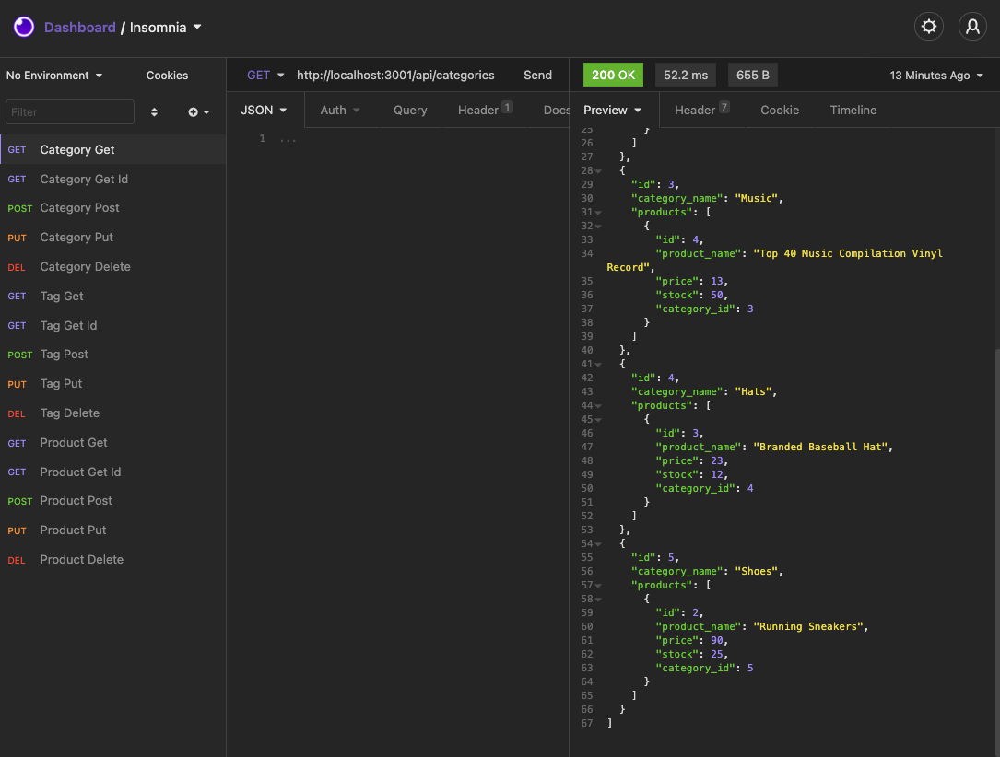

# E-Commerce Back End
## Table of Contents

1. [Description](#description)
2. [Installation](#installation-instructions)
3. [Usage](#usage)
4. [Contributing](#contributers)
5. [License](#license)

### Description
An app that uses Node.js, Express, MySQL, and Sequelize to act as a back end server for an e-commerce application. The user can utilize API routes to view the store's products/tags/categories, create a new product/tag/category, update those three designations, or delete one of them.

### Installation Instructions
1. Download the code from the repo.
2. Within the terminal, npm init and npm install.
3. Use the schema.sql file to create the database.
4. Using the .env.EXAMPLE file, create an .env with your credentials.
5. Enter 'npm run seed' in the terminal.

### Usage
From the terminal, enter 'npm start'. Then use insomnia or postman or something similar to test your routes and access the store's information.

**Example Route in Insomnia**

[Link to Application](https://github.com/rachelamos/e-commerce-back-end.git)

[Demo of My App](https://drive.google.com/file/d/1aWDaJ6084qOzihswDAnoQG8I_SEQMwFT/view)

### Questions
If you have any other questions, you can reach me:
- via email: rachelamos35@gmail.com
- via GitHub: https://github.com/rachelamos

### License
This project is covered under the [MIT](LICENSE) license.

### Contributers
© Rachel Amos